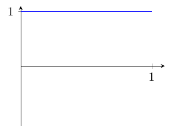
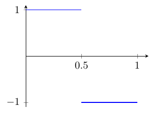
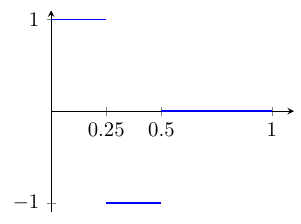
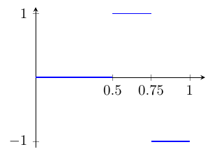
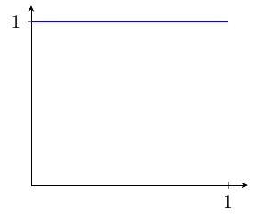
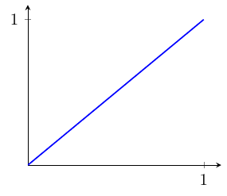
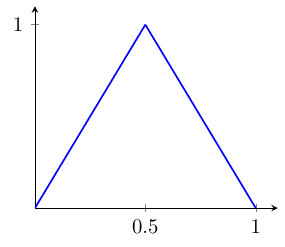
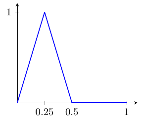
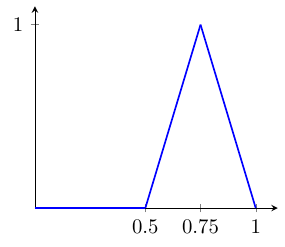

# Espacios de funciones

## El sistema de Haar {#sec-haar}

Para $1\leq p<\infty$, el espacio $(L^p(0,1),\|\!\cdot\!\|_p)$ de las (clases de equivalencia de) funciones Lebesgue--medibles definidas en casi todo punto del intervalo $(0,1)\subset\mathbb{R}$ y tales que $\int_0^1|f|^p<\infty$ dotado de la norma
$$
\|f\|_p =\Big(\int_0^1|f(t)|^p\,dt\Big)^{1/p}\quad\text{para cada $f\in L^p(0,1)$,}
$$
admite base de Schauder. Un ejemplo es la conocida como sistema de Haar, que viene dado por la sucesión de funciones $(h_n)_n$, cuyas gráficas (para $1\leq i\leq 4$) aparecen en la Figura @fig-haar.

<!-- \begin{figure}[h!]
     \begin{subfigure}[b]{0.45\textwidth}
         \centering
         \includegraphics[page=1]{figuras/haar.pdf}
         \caption{$h_1$}
     \end{subfigure}
     \hfill
     \begin{subfigure}[b]{0.45\textwidth}
         \centering
         \includegraphics[page=2]{figuras/haar.pdf}
         \caption{$h_2$}
     \end{subfigure}
     
     \begin{subfigure}[b]{0.45\textwidth}
         \centering
         \includegraphics[page=3]{figuras/haar.pdf}
         \caption{$h_3$}
     \end{subfigure}
    \hfill
    \begin{subfigure}[b]{0.45\textwidth}
         \centering
         \includegraphics[page=4]{figuras/haar.pdf}
         \caption{$h_4$}

     \end{subfigure}
    \caption{Base de Haar}
    \label{fig:haar}
\end{figure} -->

::: {#fig-haar layout-ncol=2}

{#fig-h1}

{#fig-h2}

{#fig-h3}

{#fig-h4}

Base de Haar
:::

Formalmente, enumeramos la sucesión $(h_n)_n$ del siguiente modo:
$$
\begin{align*}
    h_1(t)&=1\quad\text{para todo $t\in[0,1]$;}\\[3mm]
    h_2(t)&=\left\lbrace\begin{array}{ll}
    1, &  \text{si $t\in[0,1/2]$,}\\[2mm]
    -1, & \text{si $t\in[1/2,1]$;}
    \end{array}\right.\\[3mm]
    h_3(t)&=\left\lbrace\begin{array}{ll}
    1, & \text{si $t\in[0,1/4]$,}\\[2mm]
    -1, &  \text{si $t\in[1/4,1/2]$,}\\[2mm]
    0, & \text{si $t\in[1/2,1]$;}
    \end{array}\right.\qquad
    h_4(t)=\left\lbrace\begin{array}{ll}
    0, & \text{si $t\in[0,1/2]$,}\\[2mm]
    1, &  \text{si $t\in[1/2,3/4]$,}\\[2mm]
    -1, & \text{si $t\in[3/4,1]$.}
    \end{array}\right.
,\end{align*}
$$
Y en general, para $n\in\mathbb{N}$ e $1\leq i\leq 2^n$, si $1_A$ es la función característica del conjunto $A\subset[0,1]$, 
$$
h_{2^n+i}(t)=1_{\big[\frac{2i-2}{2^{n+1}},\frac{2i-1}{2^{n+1}}\big]}-1_{\big(\frac{2i-1}{2^{n+1}},\frac{2i}{2^{n+1}}\big]}.
$$

Para probar que $(h_i)_{i\in\N_0}$ es una base de Schauder de $L^p(0,1)$ veremos que $(h_i)_{i\in\N_0}$ es una sucesión básica en $L^p(0,1)$ y que $\overline{{\rm span}}\,\{e_i\colon i\in\mathbb{N}\}=L^p(0,1)$. Procederemos en tres etapas.

- Las funciones características de los intervalos diádicos son elementos de ${\rm span}\,\{h_i\colon i\in\mathbb{N}\}$.
    
  ::: {style = "margin-left: 1em"}
    Podemos construir las funciones características de los intervalos $[0,1/4], [1/4,1/2]$, $[1/2,3/4]$ y $[3/4,1]$ combinando linealmente las cuatro primeras funciones de la base de Haar. En efecto, pues se tiene que:
    $$
    \begin{align*}
      \frac{h_1+h_2}{4}+\frac{h_3}{2}&=\frac{1}{4}\Big[1_{[0,1]}+1_{[0,1/2]} -1_{[1/2,1]}\Big]+\frac{1}{2}\Big[1_{[0,1/4]}-1_{[1/4,1/2]}\Big]\\ 
      &=\frac{1}{4}\Big[2\cdot1_{[0,1/2]}\Big]+\frac{1}{2}\Big[1_{[0,1/4]}-1_{[1/4,1/2]}\Big]=1_{[0,1/4]},\\
      \frac{h_1 + h_2}{4}-\frac{h_3}{2}&=\cdots=1_{[1/4,1/2]},\\
      \frac{h_1-h_2}{4}+\frac{h_3}{2}&=\cdots=1_{[1/2,3/4]},\\
      \frac{h_1-h_2}{4}-\frac{h_3}{2}&=\cdots=1_{[3/4,1]}.
    \end{align*}
    $$
    Veamos ahora cómo obtener la función característica del intervalo diádico $[j/2^i,(j+1)/2^i]$ como combinación lineal de elementos de la base de Haar.
    
    - Si $j$ es impar, suponiendo que ya hemos obtenido la función característica del intervalo $[(j-1)/2^i,j/2^i]$ ---que por brevedad y comodidad denotaremos por $f$--- como combinación lineal de elementos de la base de Haar, es fácil constatar que
    $$
    \frac{1}{2}f-\frac{1}{2}h_{2^{i-1}+(j+1)/2}=1_{[j/2^i,(j+1)/2^i]}.
    $$

    - Por otra parte, si $j$ es par, suponiendo que ya hemos obtenido la función característica del intervalo $[j/2^i,(j+2)/2^i]$ ---que por brevedad y comodidad denotaremos por $g$--- como combinación lineal de elementos de la base de Haar, es fácil constatar que
    $$
    \frac{1}{2}g+\frac{1}{2}h_{2^{i-1}+(j+2)/2}=1_{[j/2^i,(j+1)/2^i]}.
    $$

  :::

- $\overline{{\rm span}}\,\{h_i\colon i\in\mathbb{N}\}=L_p[0,1]$.
    
  ::: {style = "margin-left: 1em"}
    Dada una función $f\in L^p[0,1]$, podemos suponer sin pérdida de generalidad que $f(x)\geq 0$ para casi todo $x\in[0,1]$ (en otro caso habría que descomponer $f$ en $f^+$ y $f^-$). En tal caso, si para cada $n\in\mathbb{N}$ consideramos
    $$
    g_n=\sum_{i =1}^{2^n-1}{f(i/2^n)\,1_{[i/2^n,(i+1)/2^n]}},
    $$
    entonces es evidente ---a la vista de la etapa anterior--- que $g_n\in{\rm span}\,\{h_i\colon i\in\mathbb{N}\}$ y, por otra parte, se tiene que $\|f-g_n\|\to 0$ cuando $n\to\infty$.
    
    Por tanto, $\overline{{\rm span}}\,\{h_i\colon i\in\mathbb{N}\} =L^p(0,1)$.
  :::

- El sistema de Haar es una sucesión básica en $L^p(0,1)$.
  
  ::: {style = "margin-left: 1em"}
    Probaremos que $\|f\|_p\leq \|g\|_p$ para cualesquiera funciones $f$ y $g\in{\rm span}\,\{h_i\colon  i\in\mathbb{N}\}$ que sean de la forma
    $$
    f=\sum_{i=1}^na_ih_i\quad\text{ y }\quad g=\sum_{i=1}^{m}{a_ih_i}\quad \text{con $m=n+1$}.
    $$ {#eq-6.1}
    En tal caso, el Teorema @thm-suc-basica (Criterio de Banach--Grumblum) nos permitirá deducir que el sistema de Haar es una sucesión básica en $L^p(0,1)$. En efecto, pues para $m\in\mathbb{N}$ arbitrario bastaría aplicar $m$ veces la desigualdad que probaremos:
    $$
    \big\|\sum_{i=1}^na_ih_i\big\|\leq\big\|\sum_{i= }^{n+1}a_ih_i\big\|\leq\big\|\sum_{i=1}^{n+2}a_ih_i\big\|\leq\cdots\leq \big\|\sum_{i=1}^ma_ih_i\|.
    $$
    
    A la vista de (@eq-6.1), $f$ y $g$ se diferencian únicamente en un intervalo diádico, en el que $f$ es constante, y toma por tanto cierto valor $b$, y $g$ toma dos valores: $b+a_{n+1}$ en la primera mitad y $b-a_{n+1}$ en la segunda.
    
    No obstante, dado que $|x|^p$ es una función convexa,
    $$
    |b|^p=|\frac{b + a_{n+1}}{2}+\frac{b - a_{n+1}}{2}|^p\leq|b+a_{n+1}|^p+ |b -a_{n+1}|^p,
    $$
    por lo que resulta evidente que $\|f\|_p\leq \|g\|_p$.

  :::

---

::: {.columns}

::: {.column .text-center width = "35%"}

{height="4cm"}

[Alfréd Haar](https://mathshistory.st-andrews.ac.uk/Biographies/Haar/)
<small>Budapest, 1885 - Szeged, 1933</small>
:::

::: {.column width = "5%"}

:::

::: {.column width = "60%"}

Matemático húngaro relevante en los campos del análisis en grupos---dando lugar a la medida de Haar--- así como en calculo variacional y ecuaciones en derivadas parciales. 
    
Estudió e investigó en la Universidad de Götingen bajo la tutela de David Hilbert, donde se doctoró, para luego volver a Hungría en 1912. Tras la Primera Guerra Mundial, y tras la creación de la Universidad de Szeged (resultante de mover la antigua Universidad de Kolozsvár a las fronteras de la recién fundada república de Hungría) Haar formó, junto a Frigyes Riesz, un importante centro de investigación matemática con su propia revista de gran prestgio donde publicaron gente de la talla de Von Neumann, Henri Cartan, George Pólya o Paul Erdös.

:::

:::

---

## La base de Faber--Schauder {#sec-faber}

El espacio $(\mathcal{C}([0,1]),\|\!\cdot\!\|_\infty)$ de las funciones continuas en el intervalo compacto $[0,1]\subset\mathbb{R}$ dotado de la norma de la convergencia uniforme,
$$
\|f\|_\infty =\sup_{t\in [0,1]}|f(t)|\quad\text{para cada $f\in\mathcal{C}([0,1])$,}
$$
admite base de Schauder. Un ejemplo es la conocida como base de Faber--Schauder, que viene dada por la sucesión $(f_n)_n\subset\mathcal{C}([0,1])$ cuyas gráficas (para $1\leq i\leq 5$) aparecen en la Figura @fig-faber-schauder.

::: {#fig-faber-schauder layout-nrow=2}

{#fig-f1}

{#fig-f2}

{#fig-f3}

{#fig-f4}

{#fig-f5}

Base de Faber--Schauder.

:::
<!-- 
\begin{figure}[h!]
\centering
     \begin{subfigure}[b]{0.3\textwidth}
         \centering
         \includegraphics[page=1]{figuras/faber_schauder.pdf}
         \caption{$f_1$}
     \end{subfigure}
     \hfill
     \begin{subfigure}[b]{0.3\textwidth}
         \centering
         \includegraphics[page=2]{figuras/faber_schauder.pdf}
         \caption{$f_2$}
     \end{subfigure}
     \hfill
     \begin{subfigure}[b]{0.3\textwidth}
         \centering
         \includegraphics[page=3]{figuras/faber_schauder.pdf}
         \caption{$f_3$}
     \end{subfigure}

    \begin{subfigure}[b]{0.3\textwidth}
         \centering
         \includegraphics[page=4]{figuras/faber_schauder.pdf}
         \caption{$f_4$}
         \label{fig:five over x}
     \end{subfigure}
     \qquad
     \begin{subfigure}[b]{0.3\textwidth}
         \centering
         \includegraphics[page=5]{figuras/faber_schauder.pdf}
         \caption{$f_5$}
     \end{subfigure}
     
    \caption{Base de Faber--Schauder}
    \label{fig:faber_schauder}
\end{figure} -->

Formalmente, enumeramos la sucesión $(f_n)_n$ del siguiente modo:
$$
\begin{align*}
    f_1(t)&=1\quad\text{para todo $t\in[0,1]$;}\\[3mm]
    f_2(t)&=t\quad\text{para todo $t\in[0,1]$;}\\[3mm]
    f_3(t)&=\left\lbrace\begin{array}{ll}
    2t, &  \text{si $t\in[0,1/2]$,}\\[2mm]
    2-2t, & \text{si $t\in[1/2,1]$;}
    \end{array}\right.\\[3mm]
    f_4(t)&=\left\lbrace\begin{array}{ll}
    4t, & \text{si $t\in[0,1/4]$,}\\[2mm]
    2-4t, &  \text{si $t\in[1/4,1/2]$,}\\[2mm]
    0, & \text{si $t\in[1/2,1]$;}
    \end{array}\right.\qquad
    f_5(t)=\left\lbrace\begin{array}{ll}
    0, & \text{si $t\in[0,1/2]$,}\\[2mm]
    4t-2, &  \text{si $t\in[1/2,3/4]$,}\\[2mm]
    4-4t, & \text{si $t\in[3/4,1]$.}
    \end{array}\right.
\end{align*}
$$
Y en general, para $n\in\mathbb{N}$ e $1\leq i\leq 2^n$,
$$f_{2^n+i+1}(t)=\left\lbrace\begin{array}{ll}
    f_3(2^nt+1-i), & \text{si $t\in[(i-1)/2^n,i/2^n]$,}\\[2mm]
    0, & \text{en otro caso.}
\end{array}\right.
$$

---

::: {.columns}

::: {.column .text-center width="35%"}

{height="4cm"}

[\color{blue}Georg Faber](https://mathshistory.st-andrews.ac.uk/Biographies/Faber/)  
<small>Kaiserslautern, 1877 – Múnich, 1966</small>

:::

::: {.column width="5%"}

:::

::: {.column width="60%"}

Matemático alemán. Estudió fisica y matemáticas en las universidades de Munich y Götingen y realizó trabajos que resultaron ser muy importantes en los años ochenta cuando fueron utilizados para la resolución eficaz de ecuaciones en derivadas parciales.\smallskip
    
Fue lingüista por afición, interesado tanto en lenguas modernas como antiguas y estuvo muy interesado en la enseñanza. 

:::

:::

---

La construcción (y existencia) de la base de Faber--Schauder se fundamenta en el carácter separable del intervalo $[0,1]\subset\mathbb{R}$. En realidad, bastaría con tomar cualquier sucesión $(t_n)_{n\in\N}\subset [0,1]$ cuyo conjunto de términos sea denso en $[0,1]$ y considerar como $f_n$ a la función afín que vale $1$ en el nodo $t_n$ y decae hasta $0$ en los nodos adyacentes manteniéndose nula en el resto del intervalo. Por comodidad, hemos considerado como sucesión de puntos $(t_n)_n$ a la dada por: $t_1=0$, $t_1=1$ y $t_k=i/2^m$ si $k=2^m+i$.

Consideramos, para cada $n\in\mathbb{N}$, la proyección (lineal y acotada) $P_n\colon\mathcal{C}([0,1])\longrightarrow\mathcal{C}([0,1])$ que asocia a cada función $f\in \mathcal{C}([0,1])$ la poligonal de vértices $(t_k, f(t_k))$ con $1\leq k\leq n$.

En tal caso,
$$
\begin{align*}
    P_1f=&f(0)f_1,\\
    P_2f=&f(0)f_1+\big[f(1)-f(0)f_1(1)\big]f_2,\\
    P_3f=&f(0)f_1+\big[f(1)-f(0)f_1(1)\big]f_2\\
    &+\Big[f(1/2)-f(0)f_1(1/2)-\big[f(1) -f(0)f_1(1)\big]f_2(1/2)\Big]f_3,\\
    \cdots
\end{align*}
$$
En general, 
$$
P_nf=\sum_{i=1}^n{a_if_i},
$$
donde $a_1 = f(0)$ y
$$
a_n=f(t_n)-\sum_{i=1}^{n-1}{a_nf_i(t_n)}\quad\text{para $n\geq 2$.}
$$

Conviene observar que, por ser $f_i(t_k)=0$ para todo $k<i$, al incrementar $n$, no varía el valor de los primeros sumandos, por lo que sólo hay que calcular los coeficientes de los nuevos nodos (o sumandos) añadidos.

También resulta interesante observar que por tener $P_nf$ una función con gráfica poligonal, ésta alcanza sus máximo y mínimo en uno de sus nodos (donde los valores de $f$ y $P_n f$ coinciden). Por tanto,
$$
\|P_nf\|_\infty=\max_{k\in\{1,\dots,n\}}|f(\text{nodo}_k)|\leq\sup_{x\in [0,1]} |f(x)|=\|f\|_\infty.
$$
Es decir, concluimos que $\sup_{n\in\N}\|P_n\|\leq 1$.

Probaremos que la sucesión de proyecciones $(P_n)_n$ que acabamos de introducir satisfacen las hipótesis del Teorema @thm-proyecciones, por lo que podremos afirmar que $(f_n)_n$ es base de Schauder de $(\mathcal{C}([0,1]),\|\!\cdot\!\|_\infty)$.

(a) Veamos que $\{f_i\colon i\in\mathbb{N}\}$ es un conjunto linealmente independiente en $\mathcal{C}([0,1])$. Consideremos para ello una combinación lineal arbitraria igualada a cero:
$$
\sum_{i=1}^n\lambda_if_{n_i}=0.
$$
En tal caso, evaluando en el nodo $t_{n_i}$, obtenemos que
$$
\sum_{i=1}^n\lambda_if_{n_i}(t_{n_i})=\lambda_i=0,
$$
por lo que concluimos que $\lambda_i=0$ para todo $1\leq i\leq n$. Queda entonces probado que $P_n(X)$ es un espacio vectorial de dimensión $n$.
    
(b) Trivial a la vista de la definición de las proyecciones $P_n$.
    
(c) Sea $f$ una función continua en el intervalo $[0,1]$. Tenemos que probar que $P_n f\rightrightarrows f$ uniformemente en $[0,1]$.
    
    Dado que $f$ y $P_nf$ son funciones continuas en $[0,1]$, el Teorema de Weierstrass asegura la existencia de $t^\ast_n\in [0,1]$ de modo que:
    $$
    \|P_nf-f\|_\infty=\sup_{t\in [0,1]}|P_nf(t)-f(t)|=|P_nf(t^\ast_n)-f(t^\ast_n)|
    $$

    Por otra parte, la continuidad uniforme de $f$ en $[0,1]$ asegura que para todo $\varepsilon>0$ existe $\delta>0$ de modo que si $s$, $t\in[0,1]$ y $|t-s|<\delta$, entonces $|f(t)-f(s)|<\varepsilon$.

    Además, la densidad de la sucesión de puntos $(t_n)_n\subset[0,1]$, nos permite afirmar que dado $\varepsilon>0$, existe $N_\varepsilon\in\mathbb{N}$ de modo que todo punto del intervalo $[0,1]$ dista menos que $\delta$ de algún punto del conjunto $\{t_i\colon 1\leq i\leq N_\varepsilon\}$.

    <!-- %https://personal.math.ubc.ca/~malabika/teaching/ubc/spring18/math421-510/HW2-Solution.pdf -->

    En tal caso, para $n\geq N_\varepsilon$, dado que existen $i$, $j\in\mathbb{N}$ de modo que $t^\ast_n\in[t_i,t_j]$ con $t_j-t_i<\delta$, se tiene que
    $$
    \begin{align*}
    \|P_nf-f\|_\infty &=|P_nf(t^\ast_n)-f(t^\ast_n)|=|P_nf(t^\ast_n)-P_nf(t_i)+ f(t_i)-f(t^\ast_n)|\\
    &\leq|P_nf(t^\ast_n)-P_nf(t_i)|+|f(t_i)-f(t^\ast_n)|\\
    &\leq |P_nf(t_j) - P_nf(t_i)| + |f(t_i) - f(t^*)|\\
    &=|f(t_j)-f(t_i)|+|f(t_i)-f(t^\ast_n)|<\varepsilon+\varepsilon=2\varepsilon,
    \end{align*}
    $$
    donde en la tercera línea hemos empleado que
    $$
    |P_nf(t)-P_nf(s)|<|P_nf(t_i)-P_nf(t_j)|\quad\text{para todo $s$, $t\in[t_i,t_j]$.}
    $$
    Queda justificada entonces la convergencia uniforme de $P_nf$ a $f$ en el intervalo $[0,1]$.

